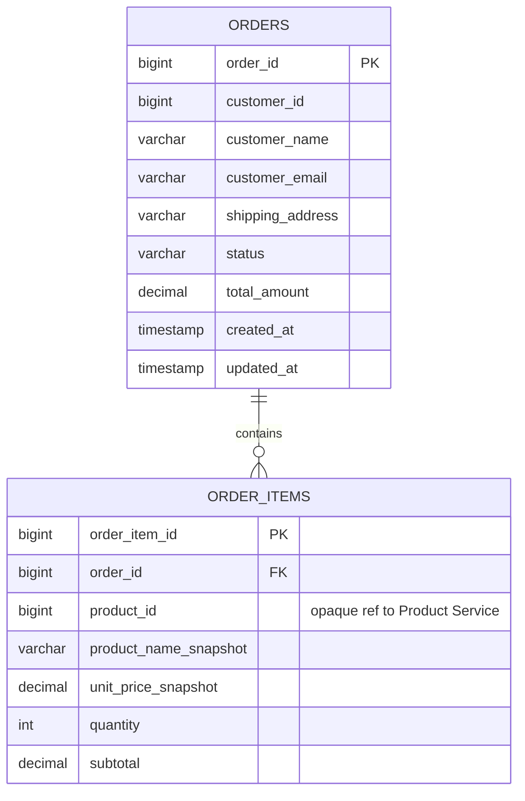

# Software Design Document
## Order Service — Mini E-Commerce Platform

| | |
|---|---|
| **Document Type** | Software Design Document (SDD) |
| **Module** | Order Service (independent microservice) |
| **Owning Team Member** | Order Service developer (1 of 4) |
| **Related Services** | Product Service (external), Notification Service (external) |
| **Status** | Draft — for team review before implementation |
| **Version** | 1.1 |

---

## 1. Introduction

This document describes the design of the **Order Service**, one of three independent microservices that make up the Mini E-Commerce Platform. It is written for a 4-person team in which each member owns exactly one service. This document covers **only** the Order Service. The Product Service and Notification Service are treated as external systems with which the Order Service integrates over well-defined contracts; their internal design is out of scope here and is the responsibility of their respective owners.

The goal is to provide enough detail — API contracts, data model, business rules, lifecycle, and integration contracts — that implementation can begin without further clarification, and that the Product Service and Notification Service can be integrated later (by other teams, on their own timelines) without forcing a redesign of the Order Service.

## 2. Project Overview

The Mini E-Commerce Platform lets customers place orders for products. It is decomposed into three microservices, each independently developed, tested, and deployed:

1. **Product Service** — owns product catalog, pricing, and inventory.
2. **Order Service** *(this document)* — owns orders, order line items, and order lifecycle.
3. **Notification Service** — owns delivery of order-related notifications (email/SMS/push).

Each service has its own database (database-per-service pattern), its own deployment unit, and communicates with the others exclusively through REST APIs (or, in future, asynchronous events). No service reaches into another service's database.

## 3. Purpose of the Order Service

The Order Service is the system of record for **orders**. Its responsibilities are:

- Accept new orders from customers (or an upstream client/UI) and persist them.
- Track the status of an order through its lifecycle.
- Provide read access to order data (single order, all orders, filtered), restricted to the owning customer or an admin.
- Coordinate — but not own — stock verification and stock reduction by calling the Product Service.
- Trigger a notification after an order is successfully confirmed, by calling the Notification Service, without waiting on it.

It does **not** decide product prices, does **not** manage inventory counts, and does **not** send emails/SMS itself.

## 4. Scope

The scope covers the design of the Order Service as a standalone Spring Boot microservice: its REST API, data model, business rules, status lifecycle, exception handling, resource-level authorization, resilience behavior toward its two dependencies, and the contracts it uses to talk to Product Service and Notification Service. Deployment topology, CI/CD pipeline design, and the internal design of the other two services are explicitly excluded.

## 5. In Scope

- Create an order (one or more line items, each referencing a `productId` and `quantity`).
- Retrieve all orders (with basic filtering/pagination), scoped to the caller's own orders unless the caller is an admin.
- Retrieve a single order by ID, subject to the same ownership scoping.
- Update the status of an order.
- Cancel an order.
- (Optional, admin-only) Hard-delete an order record.
- Validation of order input data, including rejection of duplicate `productId` values within one request.
- Calling Product Service to verify product existence, check stock, and reduce stock.
- Notifying the Notification Service on order confirmation, asynchronously.
- Order Service's own database schema (order + order line items).
- Error handling and API response contracts for all of the above.

## 6. Out of Scope

- Product catalog, product pricing, and inventory management (Product Service).
- Sending/rendering/delivering emails, SMS, or push notifications (Notification Service).
- Payment processing (assumed not part of this platform's current phase — see [Assumptions](#30-assumptions)).
- User authentication/identity issuance (assumed handled upstream, e.g., API Gateway) — Order Service consumes the authenticated identity but does not issue it.
- Implementation details, database schema, or APIs of Product Service and Notification Service — only their **contracts as consumed/produced by Order Service** are documented here.

## 7. Functional Requirements

| ID | Requirement |
|---|---|
| FR-1 | The system shall allow creation of an order containing customer information and one or more order items (`productId`, `quantity`). |
| FR-2 | Before confirming an order, the system shall verify each product exists and has sufficient stock via the Product Service, checking all items in parallel rather than sequentially. |
| FR-3 | On successful stock verification, the system shall request stock reduction from the Product Service and set the order status to `CONFIRMED`. |
| FR-4 | On failed verification (product not found or insufficient stock), the system shall reject the order and set its status to `REJECTED`, returning the reason to the caller. |
| FR-5 | The system shall retrieve all orders, optionally filtered by `status` and/or `customerId`, with pagination — scoped to the caller's own orders unless the caller holds an admin role. |
| FR-6 | The system shall retrieve a single order (with its line items) by order ID, subject to the same ownership scoping as FR-5. |
| FR-7 | The system shall allow the status of an existing order to be updated, subject to the valid state-transition rules. |
| FR-8 | The system shall allow an order to be cancelled while it is in a cancellable state, and shall not physically delete the record when cancelling. |
| FR-9 | The system may optionally support a hard delete of an order record (administrative operation, distinct from cancellation, restricted to admin-role callers). |
| FR-10 | On successful order confirmation, the system shall notify the Notification Service with the order details needed to compose a customer notification, dispatched asynchronously so the caller's response is never delayed by it. |
| FR-11 | The system shall return meaningful, structured error responses for all failure cases (validation, not-found, invalid transition, access-denied, downstream failure). |
| FR-12 | The system shall reject any request to view, modify, or cancel an order that does not belong to the calling customer (unless the caller holds an admin role), returning `403`/`404` rather than the order data. |
| FR-13 | The system shall reject a create-order request containing duplicate `productId` values within the same request with a structured `400` error, rather than relying on a database constraint to catch it. |

## 8. Non-Functional Requirements

| Category | Requirement |
|---|---|
| **Independence** | Deployable, testable, and runnable in isolation from Product Service and Notification Service (using stubs/mocks for those in dev/test). |
| **Performance** | Order creation (excluding downstream latency) should complete in < 200ms at the Order Service layer; list endpoints must be paginated (page size capped server-side, see Section 22) to avoid unbounded response sizes. |
| **Availability** | The Order Service must degrade gracefully if Product Service or Notification Service is unavailable. Circuit breaker + bulkhead isolation around `ProductServiceClient` bounds the blast radius of a Product Service outage — see Section 14. |
| **Scalability** | Stateless service; horizontally scalable behind a load balancer; no in-memory session state. Per-item Product Service checks run in parallel, not sequentially; the Notification Service call runs on a dedicated async executor isolated from the request-handling thread pool, so its latency cannot consume capacity needed for other endpoints. |
| **Data Integrity** | Order status transitions must be atomic and follow the defined state machine; no order should be left in an ambiguous state longer than the reconciliation sweep interval (see Section 31). |
| **Security** | All endpoints assume an upstream authenticated context (e.g., API Gateway / JWT). Resource-level authorization (a customer may only access their own orders; hard-delete restricted to an admin role) is enforced on every endpoint that resolves a specific order — see BR-10/BR-11. |
| **Observability** | Structured logging of all state transitions and downstream calls; correlation/trace ID propagated on outbound calls, including the asynchronously-dispatched Notification Service call. |
| **Maintainability** | Layered architecture (Controller → Service → Repository), DTOs isolated from JPA entities, external calls isolated behind client interfaces. |
| **Portability** | Business logic must not depend on a specific relational database vendor. Target engine is PostgreSQL — see Section 19/20, Assumption 1. |

## 9. Business Rules

- BR-1: An order must have exactly one customer and at least one order item.
- BR-2: Each order item references exactly one `productId` and a `quantity >= 1`. The Order Service does not store or validate product price/name — it may cache a denormalized snapshot for display purposes only (see [Entity Design](#21-entity-design)).
- BR-3: An order cannot be confirmed unless **every** item in it passes product-existence and stock-availability checks. Partial fulfillment is not supported in this version (all-or-nothing).
- BR-4: Stock is only reduced after all items are verified — never speculatively.
- BR-5: An order can only be cancelled while in `PENDING` or `CONFIRMED` state. Orders in `SHIPPED`, `DELIVERED`, `REJECTED`, or already `CANCELLED` cannot be cancelled again.
- BR-6: Cancelling a `CONFIRMED` order (i.e., one where stock was already reduced) should trigger a compensating stock-restore call to the Product Service (see [Risks](#31-risks) regarding consistency).
- BR-7: Status transitions must follow the state machine in Section 11; any other transition is rejected with `409 Conflict`.
- BR-8: Notification is only triggered on a transition **into** `CONFIRMED`, exactly once, dispatched asynchronously (see Section 15).
- BR-9: `orderId` is system-generated as a `BIGINT` surrogate key (database sequence), never client-supplied.
- BR-10: A customer may only retrieve, update, or cancel their own orders; cross-customer access attempts return `403`/`404` (without confirming whether the order exists). Admin-role callers may access any order.
- BR-11: Hard-delete (`DELETE /orders/{orderId}`) is restricted to callers holding an admin role; it is not reachable by standard customer-facing clients.
- BR-12: A `CreateOrderRequest` containing duplicate `productId` values across its items is rejected with a `400` validation error before it reaches persistence, rather than relying on the `uq_order_items_order_product` database constraint to catch it.

## 10. Order Lifecycle

```
        create order
             │
             ▼
        ┌─────────┐
        │ PENDING │  (stock verification in progress / awaiting confirmation)
        └────┬────┘
     verify  │  verify
     success │  fails
        ┌────┴─────┐
        ▼          ▼
  ┌───────────┐ ┌──────────┐
  │ CONFIRMED │ │ REJECTED │  (terminal — product invalid or out of stock)
  └─────┬─────┘ └──────────┘
        │
   ┌────┼─────────────┐
   │    │              │
   ▼    ▼              ▼
CANCELLED  SHIPPED   (cancel request)
 (terminal)   │
              ▼
          DELIVERED (terminal, future scope)
```

- `PENDING` — initial state immediately after the create request is accepted, before/while Product Service is consulted.
- `CONFIRMED` — all items verified, stock reduced, notification dispatched (asynchronously).
- `REJECTED` — terminal; verification failed (product missing or insufficient stock).
- `CANCELLED` — terminal; customer/admin cancelled a `PENDING` or `CONFIRMED` order.
- `SHIPPED` / `DELIVERED` — optional future states, included in the model now so the enum doesn't need to change later (see [Future Enhancements](#32-future-enhancements)); not required for MVP status-update flows beyond simple manual transition.

## 11. Order Status Transition Rules

| From \ To | PENDING | CONFIRMED | REJECTED | CANCELLED | SHIPPED | DELIVERED |
|---|---|---|---|---|---|---|
| **PENDING** | – | ✅ (system, post-verification) | ✅ (system, post-verification) | ✅ (user/admin) | ❌ | ❌ |
| **CONFIRMED** | ❌ | – | ❌ | ✅ (user/admin) | ✅ (admin/manual, MVP) | ❌ |
| **REJECTED** | ❌ | ❌ | – | ❌ | ❌ | ❌ |
| **CANCELLED** | ❌ | ❌ | ❌ | – | ❌ | ❌ |
| **SHIPPED** | ❌ | ❌ | ❌ | ❌ | – | ✅ (admin/manual) |
| **DELIVERED** | ❌ | ❌ | ❌ | ❌ | ❌ | – |

`PENDING → CONFIRMED/REJECTED` is a **system-driven** transition executed synchronously as part of order creation (not a separate manual API call in MVP). `→ CANCELLED` and `SHIPPED → DELIVERED` are **manual** transitions via the update-status endpoint. Any transition not marked ✅ returns `409 Conflict` with an `InvalidOrderStatusTransitionException`.

## 12. Service Responsibilities

**Owns:**
- Order aggregate (order header + order line items).
- Customer information *as attached to an order* (name, email, shipping address) — this is a snapshot captured at order time, not a customer master record.
- Order status and its transition rules.
- Quantity ordered per line item.
- Product reference (`productId` only — an opaque foreign key from the Order Service's point of view).

**Does not own** (delegates to other services):
- Product name, description, category, pricing — Product Service.
- Inventory/stock counts — Product Service (Order Service only *requests* checks/reductions).
- Notification content, templates, delivery channel, delivery status — Notification Service.
- Customer master data / authentication — Order Service stores only what's needed to fulfill the order, and trusts (does not issue) the authenticated identity it receives.

## 13. Service Boundaries

The Order Service is a bounded context whose aggregate root is `Order`. It exposes its capabilities only through its REST API and consumes other services only through their REST APIs — there is no shared database, shared JAR of entities, or direct method call across service boundaries. This keeps the three services independently deployable: as long as the contracts in Sections 14/15/29 remain stable, Product Service and Notification Service can change their internal implementation freely, and vice versa.

Key boundary decisions:
- Order Service stores `productId` as a plain value (e.g., `Long`/`UUID`), **not** a JPA relationship/foreign key into another service's table.
- Any product data shown on an order (name, price) is either fetched live from Product Service at read time, or stored as an immutable snapshot at order-creation time — this project uses the **snapshot approach** for `unitPrice`/`productName` display fields to avoid a hard read-time dependency on Product Service for historical orders (see [Entity Design](#21-entity-design), [Assumptions](#30-assumptions)).

## 14. Integration with Product Service

The Order Service is a **consumer** of the Product Service API. Product Service is not designed here; only the contract Order Service depends on is defined.

**Resilience:** `ProductServiceClient` calls are wrapped in a circuit breaker (Resilience4j) and executed on a dedicated bulkhead thread pool, isolated from the pool serving read-only endpoints (`GET /orders`, `GET /orders/{id}`). A Product Service outage can degrade order creation, but it cannot starve unrelated read traffic.

**Concurrency for multi-item orders:** per-item existence/availability checks are issued in parallel, not in a sequential loop, so total latency is bounded by the slowest single check rather than the sum of all of them.

**Calls made by Order Service, per order creation:**

1. `GET /api/v1/products/{productId}` — confirm the product exists and fetch a display snapshot (name, price). `404` ⇒ order item is invalid.
2. `GET /api/v1/products/{productId}/availability?quantity={qty}` — confirm sufficient stock. Returns `{ "available": true|false }`. (May be combined with call #1 — see [External API Contracts](#29-external-api-contracts) for both options.)
3. `POST /api/v1/products/{productId}/stock/reduce` with body `{ "quantity": <qty> }` — executed only after **all** items in the order pass checks 1 and 2. Idempotency is achieved by passing the Order Service's `orderId` as an idempotency key header (`Idempotency-Key`) so retries don't double-deduct stock.

**Proposed resolution — pending Product Service owner confirmation:** combine calls 1 and 2 into a single `GET /products/{productId}` response that already includes `stockQuantity`, cutting per-item round-trips from two to one. If the Product Service team needs multiple products checked at once, a bulk variant (e.g. `POST /products/availability/bulk` accepting a list of `{productId, quantity}`) is the alternative. Either shape is workable — this needs to be pinned down in writing with the Product Service owner before both teams build against it (see Section 29.1).

**Compensating call on cancellation of a `CONFIRMED` order:**

4. `POST /api/v1/products/{productId}/stock/restore` with body `{ "quantity": <qty> }` — best-effort compensation; see [Risks](#31-risks) for the consistency caveat (no distributed transaction), paired with a near-term reconciliation sweep (see [Risks](#31-risks)).

**Client implementation notes:**
- Isolated behind a `ProductServiceClient` interface in the `client` package so the HTTP mechanism (RestClient/RestTemplate/WebClient/OpenFeign) is an implementation detail.
- Configured with connect/read timeouts and a bounded retry policy; failures are translated into service-specific exceptions (`ProductNotFoundException`, `ProductServiceUnavailableException`), never leaked as raw HTTP exceptions.
- Base URL is externalized via configuration (`product-service.base-url`), enabling service discovery or an API gateway to be introduced later without code changes.

## 15. Integration with Notification Service

The Order Service is a **producer** with respect to Notification Service — it announces that something happened; it does not know or care how the notification is delivered.

**Trigger:** exactly once, on the `PENDING → CONFIRMED` transition, after stock reduction succeeds.

**MVP contract (synchronous REST from Notification Service's point of view, asynchronous from the caller's):**
`POST /api/v1/notifications/order-confirmations` on the Notification Service, with the payload defined in [Section 29](#29-external-api-contracts).

**Design decision:** the call to the Notification Service is dispatched via a dedicated bounded async executor (e.g., Spring `@Async` on its own thread pool, `notification-executor`), not on the request-handling thread. The order-creation request thread does not wait on this call at all — it fires the call after the local `CONFIRMED` status commit and returns the response immediately. Failure of the call is logged, not surfaced as an order-creation failure (see [Risks](#31-risks) and [Future Enhancements](#32-future-enhancements) for the recommended move to an async event/message broker to remove this coupling entirely).

## 16. High-Level Architecture

```
                         ┌───────────────────────┐
                         │   API Gateway / Client │
                         └───────────┬────────────┘
                                     │ REST (JSON)
                                     ▼
                         ┌───────────────────────┐
                         │      Order Service      │
                         │  (Spring Boot, this doc) │
                         │                         │
                         │  Controller → Service   │
                         │      → Repository       │
                         └───┬───────────────┬─────┘
                             │               │
     REST client [bulkhead+CB] │           │ async dispatch (dedicated executor)
                             ▼               ▼
                 ┌───────────────────┐  ┌───────────────────────┐
                 │  Product Service  │  │  Notification Service │
                 │ (external, other  │  │  (external, other      │
                 │  team's module)   │  │   team's module)       │
                 └───────────────────┘  └───────────────────────┘
                             
        ┌───────────────────────────────┐
        │  Order Service's own database  │
        │  (orders, order_items tables)  │
        └───────────────────────────────┘
```

Each box above is an independently deployable unit; only the Order Service box is designed/implemented as part of this document. The Product Service link runs through a bulkhead + circuit breaker; the Notification Service link is fire-and-forget on its own executor, never on the request thread.

## 17. Component Diagram (Text)

```
Order Service
 ├── OrderController                 (REST endpoints, Section 22)
 │     └── depends on → OrderService (interface)
 │
 ├── OrderServiceImpl                 (business logic, orchestration)
 │     ├── depends on → OrderRepository
 │     ├── depends on → OrderItemRepository (or cascaded via OrderRepository)
 │     ├── depends on → ProductServiceClient   (interface → HTTP impl, circuit-breaker + bulkhead wrapped)
 │     ├── depends on → NotificationServiceClient (interface → async-dispatched HTTP impl)
 │     ├── depends on → OrderOwnershipValidator (resource-level authorization)
 │     └── depends on → OrderMapper (entity <-> DTO)
 │
 ├── ProductServiceClient (interface)
 │     └── ProductServiceRestClient (impl — RestClient/Feign, Resilience4j CircuitBreaker + Bulkhead)
 │
 ├── NotificationServiceClient (interface)
 │     └── NotificationServiceRestClient (impl, invoked via @Async on notification-executor)
 │
 ├── OrderRepository (Spring Data JPA)
 ├── OrderItemRepository (Spring Data JPA)
 │
 ├── Entities: Order, OrderItem, OrderStatus (enum)
 ├── DTOs: request/*, response/*
 ├── Exceptions: OrderNotFoundException, InvalidOrderStatusTransitionException,
 │               ProductNotFoundException, InsufficientStockException,
 │               ProductServiceUnavailableException, OrderAccessDeniedException,
 │               DuplicateProductInOrderException
 └── GlobalExceptionHandler (@ControllerAdvice)
```

## 18. Package Structure

```
com.training.orderservice
 ├── controller
 │     └── OrderController
 ├── service
 │     ├── OrderService                     (interface)
 │     └── impl/OrderServiceImpl
 ├── security
 │     └── OrderOwnershipValidator
 ├── client
 │     ├── ProductServiceClient             (interface)
 │     ├── impl/ProductServiceRestClient
 │     ├── NotificationServiceClient        (interface)
 │     └── impl/NotificationServiceRestClient
 ├── repository
 │     ├── OrderRepository
 │     └── OrderItemRepository
 ├── entity
 │     ├── Order
 │     ├── OrderItem
 │     └── OrderStatus (enum)
 ├── dto
 │     ├── request/CreateOrderRequest, OrderItemRequest, UpdateOrderStatusRequest
 │     └── response/OrderResponse, OrderItemResponse, ErrorResponse
 ├── mapper
 │     └── OrderMapper
 ├── exception
 │     ├── OrderNotFoundException
 │     ├── InvalidOrderStatusTransitionException
 │     ├── ProductNotFoundException
 │     ├── InsufficientStockException
 │     ├── ProductServiceUnavailableException
 │     ├── OrderAccessDeniedException
 │     ├── DuplicateProductInOrderException
 │     └── GlobalExceptionHandler
 └── config
       ├── RestClientConfig                 (timeouts, base URLs, circuit breaker + bulkhead)
       ├── AsyncConfig                      (dedicated notification-executor thread pool)
       └── OpenApiConfig                     (future — API docs)
```

This matches the existing project skeleton (`groupId: com.training`, `artifactId: order-service`, base package `com.training.orderservice`).

## 19. Database Design

> **Note on database engine:** the functional brief for this exercise references MySQL, but the project's `pom.xml` is configured with the PostgreSQL driver (`org.postgresql:postgresql`). **PostgreSQL** is the target engine for this design. MySQL syntax notes are retained only as migration context in case the team switches engines.

**Table: `orders`**

| Column | Type | Constraints |
|---|---|---|
| order_id | BIGINT (sequence-generated) | PK |
| customer_id | BIGINT | NOT NULL |
| customer_name | VARCHAR(150) | NOT NULL |
| customer_email | VARCHAR(150) | NOT NULL |
| shipping_address | VARCHAR(500) | NOT NULL |
| status | VARCHAR(20) | NOT NULL, default `PENDING` |
| total_amount | DECIMAL(12,2) | NOT NULL, default 0 (sum of line items) |
| created_at | TIMESTAMP | NOT NULL, default now |
| updated_at | TIMESTAMP | NOT NULL, auto-updated |

**Table: `order_items`**

| Column | Type | Constraints |
|---|---|---|
| order_item_id | BIGINT (sequence-generated) | PK |
| order_id | BIGINT | FK → `orders.order_id`, NOT NULL, `ON DELETE CASCADE` |
| product_id | BIGINT | NOT NULL (opaque reference to Product Service) |
| product_name_snapshot | VARCHAR(200) | NOT NULL (denormalized at order time) |
| unit_price_snapshot | DECIMAL(12,2) | NOT NULL (denormalized at order time) |
| quantity | INT | NOT NULL, `CHECK (quantity >= 1)` |
| subtotal | DECIMAL(12,2) | NOT NULL, generated = `unit_price_snapshot * quantity` |

**Indexes:**
- `idx_orders_customer_id` on `orders(customer_id)`
- `idx_orders_status` on `orders(status)`
- `idx_orders_created_at` on `orders(created_at)`
- `idx_order_items_order_id` on `order_items(order_id)` (usually created automatically by the FK)

**Design decision:** `order_items` is a child table (one-to-many from `orders`), not a single `product_id`/`quantity` column pair on `orders` itself. This matches real e-commerce carts (multiple products per order) and satisfies "quantity ordered" + "product reference" per line item, while still letting a simple order have just one row in `order_items`. Naming is standardized on `order_items`/`order_id`/`order_item_id` (plural table, matching `orders`) consistently across this section, Section 20, and Section 21.

## 20. Database Schema

### 20.1 SQL DDL

Production-ready DDL for PostgreSQL, the confirmed target engine. ID generation uses named sequences rather than `GENERATED ALWAYS AS IDENTITY` — see the design-decision note below the DDL for why.

```sql
-- =====================================================================
-- Order Service — Schema DDL (PostgreSQL, sequence-based IDs)
-- =====================================================================

CREATE SEQUENCE orders_id_seq START WITH 1000 INCREMENT BY 50;
CREATE SEQUENCE order_items_id_seq START WITH 1000 INCREMENT BY 50;

CREATE TABLE orders (
    order_id            BIGINT PRIMARY KEY DEFAULT nextval('orders_id_seq'),
    customer_id         BIGINT NOT NULL,
    customer_name       VARCHAR(150) NOT NULL,
    customer_email      VARCHAR(150) NOT NULL,
    shipping_address    VARCHAR(500) NOT NULL,
    status              VARCHAR(20) NOT NULL DEFAULT 'PENDING',
    total_amount        DECIMAL(12,2) NOT NULL DEFAULT 0.00,
    created_at          TIMESTAMP NOT NULL DEFAULT CURRENT_TIMESTAMP,
    updated_at          TIMESTAMP NOT NULL DEFAULT CURRENT_TIMESTAMP,

    CONSTRAINT chk_orders_status CHECK (
        status IN ('PENDING','CONFIRMED','REJECTED','CANCELLED','SHIPPED','DELIVERED')
    ),
    CONSTRAINT chk_orders_total_amount_non_negative CHECK (total_amount >= 0)
);

CREATE INDEX idx_orders_customer_id ON orders(customer_id);
CREATE INDEX idx_orders_status      ON orders(status);
CREATE INDEX idx_orders_created_at  ON orders(created_at);

CREATE TABLE order_items (
    order_item_id           BIGINT PRIMARY KEY DEFAULT nextval('order_items_id_seq'),
    order_id                BIGINT NOT NULL,
    product_id              BIGINT NOT NULL,
    product_name_snapshot   VARCHAR(200) NOT NULL,
    unit_price_snapshot     DECIMAL(12,2) NOT NULL,
    quantity                INT NOT NULL,
    subtotal                DECIMAL(12,2) GENERATED ALWAYS AS (unit_price_snapshot * quantity) STORED,

    CONSTRAINT fk_order_items_order_id
        FOREIGN KEY (order_id) REFERENCES orders(order_id) ON DELETE CASCADE,
    CONSTRAINT chk_order_items_quantity_positive CHECK (quantity >= 1),
    CONSTRAINT chk_order_items_unit_price_non_negative CHECK (unit_price_snapshot >= 0),
    CONSTRAINT uq_order_items_order_product UNIQUE (order_id, product_id)
);

CREATE INDEX idx_order_items_order_id   ON order_items(order_id);
CREATE INDEX idx_order_items_product_id ON order_items(product_id);
```

**Why sequences instead of `IDENTITY`:** `GENERATED ALWAYS AS IDENTITY` maps to Hibernate's `GenerationType.IDENTITY`, which forces one-row-at-a-time inserts and disables JDBC batching, because Hibernate must round-trip to the DB to learn the generated key before processing the next entity. A named sequence with `GenerationType.SEQUENCE` and a batched `allocationSize` (e.g., 50, matching `INCREMENT BY 50` above) lets Hibernate pre-allocate a block of IDs and batch inserts instead — a real win on the order-creation hot path, at the cost of small ID gaps on app restart. (MySQL/MariaDB pre-8.0 lack real sequences; a table-based hi-lo allocator is the usual substitute if the team ultimately picks MySQL.)

Notes:
- `subtotal` is a computed/generated column (`GENERATED ALWAYS AS ... STORED`), supported by both PostgreSQL 12+ and MySQL 5.7+, so it can never drift from `unit_price_snapshot * quantity`.
- `uq_order_items_order_product` prevents the same product appearing as two separate line items on one order — a repeat purchase within an order should increase `quantity` on the existing row instead. This is now backed by an explicit DTO-level validation too (BR-12, Section 24), so a violation surfaces as a clean `400` rather than a raw constraint error.
- No foreign key references a Product Service table — `product_id` is stored as a plain, unconstrained column (see Section 20.4).

### 20.2 Entity Relationship Diagram (ERD)

**Mermaid:**


**Text-based:**
```
┌───────────────────────────┐
│           orders           │
├───────────────────────────┤
│ PK  order_id                │
│     customer_id             │
│     customer_name           │
│     customer_email          │
│     shipping_address        │
│     status                  │
│     total_amount            │
│     created_at              │
│     updated_at               │
└─────────────┬─────────────┘
              │ 1
              │
              │  contains
              │
              │ N
┌─────────────┴─────────────┐
│        order_items         │
├───────────────────────────┤
│ PK  order_item_id           │
│ FK  order_id  ─────────────┼──▶ orders.order_id
│     product_id  (opaque ref to Product Service — no FK)
│     product_name_snapshot   │
│     unit_price_snapshot     │
│     quantity                 │
│     subtotal                 │
└───────────────────────────┘

orders
    |
    | 1
    |
    |----< order_items
```

### 20.3 Data Dictionary

**Table: `orders`**

| Column | Data Type | Length | Nullable | Default | Description | Constraint |
|---|---|---|---|---|---|---|
| order_id | BIGINT (sequence) | – | No | `nextval('orders_id_seq')` | Surrogate primary key | PK |
| customer_id | BIGINT | – | No | – | Customer placing the order (opaque reference; no Customer Service in this platform) | NOT NULL |
| customer_name | VARCHAR | 150 | No | – | Customer display name captured at order time | NOT NULL |
| customer_email | VARCHAR | 150 | No | – | Customer email captured at order time | NOT NULL |
| shipping_address | VARCHAR | 500 | No | – | Delivery address for this order | NOT NULL |
| status | VARCHAR | 20 | No | `'PENDING'` | Current lifecycle state (Section 10/11) | NOT NULL, CHECK enum |
| total_amount | DECIMAL | 12,2 | No | `0.00` | Sum of all `order_items.subtotal` | NOT NULL, CHECK ≥ 0 |
| created_at | TIMESTAMP | – | No | `CURRENT_TIMESTAMP` | Row creation time | NOT NULL |
| updated_at | TIMESTAMP | – | No | `CURRENT_TIMESTAMP` | Last modification time (app-updated on every status change) | NOT NULL |

**Table: `order_items`**

| Column | Data Type | Length | Nullable | Default | Description | Constraint |
|---|---|---|---|---|---|---|
| order_item_id | BIGINT (sequence) | – | No | `nextval('order_items_id_seq')` | Surrogate primary key | PK |
| order_id | BIGINT | – | No | – | Parent order | FK → `orders.order_id`, `ON DELETE CASCADE` |
| product_id | BIGINT | – | No | – | Opaque reference to a product in Product Service — no FK (Section 20.4) | NOT NULL |
| product_name_snapshot | VARCHAR | 200 | No | – | Product name at order time (denormalized, Section 20.5) | NOT NULL |
| unit_price_snapshot | DECIMAL | 12,2 | No | – | Unit price at order time (denormalized, Section 20.5) | NOT NULL, CHECK ≥ 0 |
| quantity | INT | – | No | – | Units of this product ordered | NOT NULL, CHECK ≥ 1 |
| subtotal | DECIMAL | 12,2 | No | computed | `unit_price_snapshot * quantity`, generated column | NOT NULL (generated) |
| *(composite)* | – | – | – | – | A product may appear at most once per order | UNIQUE (`order_id`, `product_id`) |

### 20.4 Relationships

- **One Order contains many Order Items** — `orders (1) ──< order_items (N)`, enforced by `order_items.order_id` referencing `orders.order_id`.
- **One Order Item belongs to exactly one Order** — `order_items.order_id` is `NOT NULL`; an order item cannot exist without its parent order.
- **Product is referenced only by `product_id`** — `order_items.product_id` is a plain `BIGINT` value with no foreign key, since the product record lives in the Product Service's own database.
- **No cross-microservice foreign keys** — the Order Service database has zero FK constraints pointing at any table owned by Product Service or Notification Service. Each microservice owns and migrates its own schema independently (database-per-service pattern, Section 20.5); referential integrity for `product_id` is enforced at the application layer via the Product Service API call in Section 14, not at the database layer.

### 20.5 Database Design Decisions

- **`order_items` is a separate table, not columns on `orders`.** An order may contain multiple products, each with its own quantity and price; modeling this as a child table supports that without limiting an order to a single line item, while still allowing a simple one-item order to be just one child row.
- **Product information is stored as a snapshot (`product_name_snapshot`, `unit_price_snapshot`).** Product name and price can change after an order is placed (Product Service is the owner and may update either at any time). Snapshotting at order-creation time guarantees historical orders display what the customer actually saw and paid, without requiring a live call to Product Service every time an old order is read.
- **Cross-microservice foreign keys are avoided.** A physical FK from `order_items.product_id` to a Product Service table would require both services to share a database or replicate schemas, which breaks independent deployability — either service could no longer be migrated, scaled, or released without coordinating with the other.
- **Database-per-service pattern is followed.** The Order Service owns and exclusively accesses this schema; Product Service and Notification Service each own their own database. This is what allows all three services (and their three different developers) to evolve their schemas independently, matching the team's one-developer-per-service structure described in Section 2.

### 20.6 Sample Database Records

**`orders`**

| order_id | customer_id | customer_name | customer_email | shipping_address | status | total_amount | created_at | updated_at |
|---|---|---|---|---|---|---|---|---|
| 1001 | 101 | Jane Doe | jane.doe@example.com | 221B Baker Street, London | CONFIRMED | 145.50 | 2026-07-16 10:15:30 | 2026-07-16 10:15:32 |
| 1002 | 102 | Raj Mehta | raj.mehta@example.com | 12 MG Road, Bengaluru | PENDING | 25.00 | 2026-07-16 11:02:10 | 2026-07-16 11:02:10 |
| 1003 | 101 | Jane Doe | jane.doe@example.com | 221B Baker Street, London | CANCELLED | 95.50 | 2026-07-15 09:40:05 | 2026-07-15 09:55:00 |

**`order_items`**

| order_item_id | order_id | product_id | product_name_snapshot | unit_price_snapshot | quantity | subtotal |
|---|---|---|---|---|---|---|
| 5001 | 1001 | 55 | Wireless Mouse | 25.00 | 2 | 50.00 |
| 5002 | 1001 | 78 | Mechanical Keyboard | 95.50 | 1 | 95.50 |
| 5003 | 1002 | 55 | Wireless Mouse | 25.00 | 1 | 25.00 |
| 5004 | 1003 | 78 | Mechanical Keyboard | 95.50 | 1 | 95.50 |

### 20.7 Naming Conventions

| Element | Convention | Example |
|---|---|---|
| Table names | Plural, `snake_case`, no prefix | `orders`, `order_items` |
| Column names | `snake_case`, descriptive, no Hungarian prefixes | `customer_email`, `shipping_address` |
| Primary key | `<singular_table>_id` | `order_id`, `order_item_id` |
| Foreign key | Same name as the referenced table's PK, so the relationship is obvious from the column name alone | `order_items.order_id` → `orders.order_id` |
| Index | `idx_<table>_<column(s)>` | `idx_orders_status`, `idx_order_items_order_id` |
| Check constraint | `chk_<table>_<rule>` | `chk_orders_status`, `chk_order_items_quantity_positive` |
| Unique constraint | `uq_<table>_<column(s)>` | `uq_order_items_order_product` |
| Foreign key constraint | `fk_<table>_<column>` | `fk_order_items_order_id` |

## 21. Entity Design

**`Order` (aggregate root)**
- `id`, `customerId`, `customerName`, `customerEmail`, `shippingAddress`
- `status` (enum `OrderStatus`: `PENDING`, `CONFIRMED`, `REJECTED`, `CANCELLED`, `SHIPPED`, `DELIVERED`)
- `totalAmount`
- `items: List<OrderItem>` — `@OneToMany(mappedBy = "order", cascade = CascadeType.ALL, orphanRemoval = true)`
- `createdAt`, `updatedAt` — auditing fields

**`OrderItem`**
- `id`, `order: Order` (`@ManyToOne`), `productId`, `productNameSnapshot`, `unitPriceSnapshot`, `quantity`, `subtotal`

**`OrderStatus`** — enum as listed above.

**Column mapping:** `Order.id` maps to column `order_id` via `@Id @GeneratedValue(strategy = GenerationType.SEQUENCE, generator = "orders_seq") @SequenceGenerator(name = "orders_seq", sequenceName = "orders_id_seq", allocationSize = 50) @Column(name = "order_id")`. The same pattern applies to `OrderItem.id` → `order_item_id` with `order_items_id_seq`. This makes the Java-field-to-DB-column relationship explicit, since the Java field name (`id`) and the DB column name (`order_id`/`order_item_id`) differ.

Entities are never returned directly from controllers; all API traffic goes through DTOs (Section 23), keeping the persistence model free to evolve independently of the public contract.

## 22. REST API Specification

Base path: `/api/v1/orders`

| Method | Path | Description | Success | Failure |
|---|---|---|---|---|
| POST | `/api/v1/orders` | Create a new order | `201 Created` + `OrderResponse` | `400` validation, `404` product not found, `409` insufficient stock |
| GET | `/api/v1/orders` | List orders (query: `status`, `customerId`, `page`, `size`) — scoped to caller's own orders unless admin | `200 OK` + paged `OrderResponse[]` | `400` invalid filter |
| GET | `/api/v1/orders/{orderId}` | Get one order | `200 OK` + `OrderResponse` | `403`/`404` not found or not owned by caller |
| PATCH | `/api/v1/orders/{orderId}/status` | Update order status | `200 OK` + `OrderResponse` | `403`/`404` not found/not owned, `409` invalid transition |
| POST | `/api/v1/orders/{orderId}/cancel` | Cancel an order | `200 OK` + `OrderResponse` | `403`/`404` not found/not owned, `409` not cancellable |
| DELETE | `/api/v1/orders/{orderId}` | *(Optional, admin-only)* Hard-delete an order | `204 No Content` | `403` not admin, `404` not found |

Notes:
- `POST .../cancel` is used instead of overloading the generic status-update endpoint, so "cancel" carries its own authorization/business rule (BR-5, BR-6) distinct from arbitrary status edits.
- List endpoint defaults: `page=0`, `size=20`, sorted by `createdAt DESC`. `size` is capped server-side at a maximum of 100 regardless of what the client requests — values above the cap are clamped, not rejected, to protect the database from an unbounded scan.
- Every endpoint that resolves a specific `orderId` enforces resource-level authorization first (BR-10): the caller's `customerId` must match the order's `customerId`, or the caller must hold an admin role. A mismatch returns `403` (or `404`, to avoid confirming the order's existence — pick one convention consistently). The `DELETE` endpoint additionally requires the admin role regardless of ownership (BR-11).

## 23. Request and Response Models

**`CreateOrderRequest`**
```json
{
  "customerId": 101,
  "customerName": "Jane Doe",
  "customerEmail": "jane.doe@example.com",
  "shippingAddress": "221B Baker Street, London",
  "items": [
    { "productId": 55, "quantity": 2 },
    { "productId": 78, "quantity": 1 }
  ]
}
```

**`UpdateOrderStatusRequest`**
```json
{ "status": "SHIPPED" }
```

**`OrderResponse`**
```json
{
  "orderId": 1001,
  "customerId": 101,
  "customerName": "Jane Doe",
  "customerEmail": "jane.doe@example.com",
  "shippingAddress": "221B Baker Street, London",
  "status": "CONFIRMED",
  "totalAmount": 145.50,
  "items": [
    { "productId": 55, "productName": "Wireless Mouse", "unitPrice": 25.00, "quantity": 2, "subtotal": 50.00 },
    { "productId": 78, "productName": "Mechanical Keyboard", "unitPrice": 95.50, "quantity": 1, "subtotal": 95.50 }
  ],
  "createdAt": "2026-07-16T10:15:30Z",
  "updatedAt": "2026-07-16T10:15:32Z"
}
```

**`ErrorResponse`**
```json
{
  "timestamp": "2026-07-16T10:16:00Z",
  "status": 409,
  "error": "INSUFFICIENT_STOCK",
  "message": "Product 78 has only 0 units available, requested 1.",
  "path": "/api/v1/orders"
}
```

New error codes follow the same `ErrorResponse` shape: `DUPLICATE_PRODUCT_IN_ORDER` (400) and `ORDER_ACCESS_DENIED` (403).

## 24. Validation Rules

| Field | Rule |
|---|---|
| `customerId` | required, positive |
| `customerName` | required, max 150 chars |
| `customerEmail` | required, valid email format |
| `shippingAddress` | required, max 500 chars |
| `items` | required, min size 1 |
| `items[].productId` | required, positive |
| `items[].quantity` | required, integer ≥ 1 |
| `items[]` (as a set) | no duplicate `productId` values across items in the same request — rejected with `400 DUPLICATE_PRODUCT_IN_ORDER` (BR-12) rather than surfacing the DB unique-constraint error |
| `status` (update) | required, must be one of the `OrderStatus` enum values |
| `orderId` (path) | must resolve to an existing order owned by the caller (or caller is admin), else `403`/`404` |
| `page` / `size` (query) | `size` clamped server-side to a maximum of 100 |

Validation is enforced at the DTO layer (Bean Validation annotations plus the duplicate-`productId` check) before any business logic or downstream calls execute, so malformed requests fail fast without consuming Product Service quota.

## 25. Exception Handling Strategy

A centralized `@ControllerAdvice` (`GlobalExceptionHandler`) maps exceptions to the `ErrorResponse` contract:

| Exception | HTTP Status | Error code |
|---|---|---|
| `MethodArgumentNotValidException` (bean validation) | 400 | `VALIDATION_ERROR` |
| `OrderNotFoundException` | 404 | `ORDER_NOT_FOUND` |
| `ProductNotFoundException` | 404 | `PRODUCT_NOT_FOUND` |
| `InsufficientStockException` | 409 | `INSUFFICIENT_STOCK` |
| `InvalidOrderStatusTransitionException` | 409 | `INVALID_STATUS_TRANSITION` |
| `ProductServiceUnavailableException` | 503 | `PRODUCT_SERVICE_UNAVAILABLE` |
| `OrderAccessDeniedException` | 403 | `ORDER_ACCESS_DENIED` |
| `DuplicateProductInOrderException` | 400 | `DUPLICATE_PRODUCT_IN_ORDER` |
| `NotificationServiceException` | *(not surfaced to client — logged only, see Section 15)* | n/a |
| `Exception` (fallback) | 500 | `INTERNAL_ERROR` |

Downstream client exceptions (from `ProductServiceClient`) are translated at the client boundary into the domain-specific exceptions above — the service layer never handles raw `HttpClientErrorException`/`RestClientException` types directly.

## 26. Sequence Diagram — Place Order

```
Client            OrderController        OrderServiceImpl        ProductServiceClient      ProductService        NotificationServiceClient   NotificationService     DB
  │  POST /orders        │                       │                       │                       │                        │                     │            │
  │──────────────────────▶                       │                       │                       │                        │                     │            │
  │                      │──createOrder(req)────▶│                       │                       │                        │                     │            │
  │                      │                       │──save (status=PENDING)───────────────────────────────────────────────────────────────────────────────────▶│
  │                      │                       │                       │                       │                        │                     │            │
  │                      │                       │──[PARALLEL] for each item: checkProduct + checkStock──▶│                       │                        │                     │            │
  │                      │                       │                       │──GET /products/{id}──▶│                       │                        │                     │            │
  │                      │                       │                       │◀──200 OK / 404────────│                       │                        │                     │            │
  │                      │                       │                       │──GET /availability──▶│                       │                        │                     │            │
  │                      │                       │                       │◀──available:true/false│                       │                        │                     │            │
  │                      │                       │   (if any check fails)│                       │                        │                     │            │
  │                      │                       │──update status=REJECTED──────────────────────────────────────────────────────────────────────────────────▶│
  │                      │◀──201 Created (REJECTED, reason)──────────────│                       │                        │                     │            │
  │◀─────────────────────│                       │                       │                       │                        │                     │            │
  │                      │                       │   (if all checks pass)│                       │                        │                     │            │
  │                      │                       │──reduceStock(productId, qty) per item──────────▶│                       │                        │                     │            │
  │                      │                       │                       │──POST /stock/reduce──▶│                       │                        │                     │            │
  │                      │                       │                       │◀──200 OK──────────────│                       │                        │                     │            │
  │                      │                       │──update status=CONFIRMED (local commit)──────────────────────────────────────────────────────────────────▶│
  │                      │◀──201 Created (CONFIRMED)                     │                       │                        │                     │            │
  │◀─────────────────────│                       │                       │                       │                        │                     │            │
  │                      │                       │──[AFTER responding, on notification-executor, fire-and-forget]────────▶│                     │            │
  │                      │                       │                       │                       │                        │──POST /order-confirmations──▶│
  │                      │                       │                       │                       │                        │◀──202 Accepted (best-effort)──│
```

Notes on this flow:
1. Product existence/availability checks for all items are issued **in parallel**, not in a sequential per-item loop — bounds worst-case latency to the slowest single check rather than the sum of all checks.
2. The response to the client (`201 Created`) is returned immediately after the local `CONFIRMED` commit. The Notification Service call happens **after** that, on a separate executor — neither the client nor the thread that served the request waits on it.

## 27. Sequence Diagram — Update Order Status

```
Client        OrderController      OrderServiceImpl      OrderOwnershipValidator      OrderRepository       DB
  │ PATCH /orders/{id}/status │                    │                     │                    │
  │────────────────────────▶ │                    │                     │                    │
  │                          │──updateStatus(id, newStatus)──▶│                     │                    │
  │                          │                    │──findById(id)──────────────────────────▶│
  │                          │                    │◀──Order──────────────────────────────────│
  │                          │                    │──checkOwnership(caller, order)──▶│                    │
  │                          │                    │◀──allowed / 403───│                    │
  │                          │                    │  validate transition (Section 11)
  │                          │                    │  [invalid] throw InvalidOrderStatusTransitionException
  │                          │                    │  [valid]   set status, updatedAt
  │                          │                    │──save(order)───────────────────────────▶│
  │                          │◀──OrderResponse────│                     │                    │
  │◀─────────────────────────│                    │                     │                    │
```

The ownership check (BR-10) happens before the transition validation, so a caller who doesn't own the order never learns anything about its current status.

## 28. Sequence Diagram — Cancel Order

```
Client        OrderController      OrderServiceImpl      OrderOwnershipValidator      ProductServiceClient    ProductService     OrderRepository    DB
  │ POST /orders/{id}/cancel │                    │                     │                    │              │
  │─────────────────────────▶│                    │                     │                    │              │
  │                          │──cancelOrder(id)──▶│                     │                    │              │
  │                          │                    │──findById(id)──────────────────────────────────────────▶│
  │                          │                    │◀──Order─────────────────────────────────────────────────│
  │                          │                    │──checkOwnership(caller, order)──▶│                    │              │
  │                          │                    │◀──allowed / 403───│                    │              │
  │                          │                    │  check status ∈ {PENDING, CONFIRMED} (BR-5)
  │                          │                    │  [not cancellable] throw InvalidOrderStatusTransitionException
  │                          │                    │  [was CONFIRMED] restoreStock(items)──▶│                    │
  │                          │                    │                     │──POST /stock/restore──▶│              │
  │                          │                    │                     │◀──200 OK (best-effort)──│              │
  │                          │                    │  [restore failed] record for reconciliation sweep (Section 31)
  │                          │                    │  set status = CANCELLED, updatedAt
  │                          │                    │──save(order)────────────────────────────────────────────▶│
  │                          │◀──OrderResponse────│                     │                    │              │
  │◀─────────────────────────│                    │                     │                    │              │
```

## 29. External API Contracts

These are the contracts the Order Service **depends on** or **produces for**. They are proposed interface contracts for the other teams to implement — Order Service does not implement either side of these.

### 29.1 Product Service (consumed by Order Service)

**Contract shape — recommended, pending Product Service owner sign-off:** combine existence + availability into one call, `GET /api/v1/products/{productId}` returning `stockQuantity` directly, so Order Service compares client-side instead of making a second round-trip. If the Product Service owner prefers a dedicated availability endpoint instead, that's still workable — either way, this needs to be confirmed in writing before both teams build.

`GET /api/v1/products/{productId}`
```json
// 200 OK
{ "productId": 55, "name": "Wireless Mouse", "price": 25.00, "stockQuantity": 40 }
// 404 Not Found → { "error": "PRODUCT_NOT_FOUND", "message": "Product 55 does not exist" }
```

`GET /api/v1/products/{productId}/availability?quantity={qty}` *(fallback shape, if Product Service prefers a separate endpoint)*
```json
// 200 OK
{ "productId": 55, "requestedQuantity": 2, "available": true }
```

`POST /api/v1/products/{productId}/stock/reduce`
Headers: `Idempotency-Key: <orderId>`
```json
// Request
{ "quantity": 2 }
// 200 OK
{ "productId": 55, "remainingStock": 38 }
// 409 Conflict (race condition — stock changed since availability check)
{ "error": "INSUFFICIENT_STOCK", "message": "Only 1 unit available" }
```

`POST /api/v1/products/{productId}/stock/restore` (compensation on cancellation)
```json
// Request
{ "quantity": 2 }
// 200 OK
{ "productId": 55, "remainingStock": 40 }
```

### 29.2 Notification Service (produced/called by Order Service)

`POST /api/v1/notifications/order-confirmations` (dispatched via `notification-executor`, not the request thread)
```json
// Request
{
  "orderId": 1001,
  "customerId": 101,
  "customerName": "Jane Doe",
  "customerEmail": "jane.doe@example.com",
  "totalAmount": 145.50,
  "items": [
    { "productName": "Wireless Mouse", "quantity": 2 },
    { "productName": "Mechanical Keyboard", "quantity": 1 }
  ],
  "confirmedAt": "2026-07-16T10:15:32Z"
}
// 202 Accepted (Notification Service queues delivery asynchronously)
```

**Recommended future contract:** replace this synchronous call with Order Service publishing an `OrderConfirmedEvent` (same payload) to a message broker topic/queue (e.g., Kafka topic `order.confirmed`), which the Notification Service subscribes to. This removes the runtime coupling entirely — the async-executor dispatch reduces the coupling's practical impact today, but does not remove it (see [Future Enhancements](#32-future-enhancements)).

## 30. Assumptions

1. Target engine is PostgreSQL, matching the `pom.xml` dependency. The functional brief references MySQL; schema DDL in Section 20 is written for PostgreSQL directly, and MySQL notes are kept only as migration context.
2. Authentication is handled upstream (API Gateway or a shared auth filter); Order Service trusts the caller identity (including `customerId` and role claims) it receives, and enforces resource-level authorization against that identity (BR-10/BR-11) for all data access.
3. Payment processing is not part of the current platform phase; orders are created and confirmed without a payment step.
4. Product Service exposes the endpoints in Section 29.1 with those exact semantics; if the real Product Service differs, only the `ProductServiceClient` implementation needs to change, not the Order Service's domain logic.
5. Notification Service accepts the fire-and-forget contract in Section 29.2 and is responsible for its own retry/delivery guarantees.
6. Each order line item references exactly one product; bundles/kits are out of scope.
7. Currency is a single implicit default (e.g., USD) — no multi-currency support in this phase.
8. `customerId` is supplied via the authenticated caller context (no dedicated Customer Service in this platform); Order Service compares it against `order.customerId` for authorization but does not validate it against an external identity store.
9. Network calls to Product Service and Notification Service are synchronous HTTP in this phase; both services are reachable via configured base URLs (no service discovery yet).
10. Soft-delete via `CANCELLED` status is the primary "removal" mechanism; hard delete (Section 22) is an optional admin-only capability, not part of the customer-facing flow.

## 31. Risks

| Risk | Impact | Mitigation |
|---|---|---|
| Product Service unavailable during order creation | Orders can't be verified/confirmed | Timeouts + circuit breaker + bulkhead (Section 14); return `503` with a clear error rather than hanging or starving other endpoints |
| Stock race condition between availability check and reduce | Overselling | Rely on Product Service's own atomic reduce-stock endpoint returning `409` on conflict; Order Service treats that as rejection |
| No distributed transaction across Order/Product/Notification | Partial failure leaves inconsistent state (e.g., stock reduced but order not marked CONFIRMED due to a crash) | Accepted risk. Near-term: a scheduled reconciliation sweep detects orders stuck in a transient state past a threshold and retries the status commit or triggers stock/restore. Longer-term: Saga pattern (orchestration) |
| Notification Service failure after order confirmed | Customer doesn't get notified, but order is valid | Non-blocking/best-effort by design; failures logged; future: async event + retry via broker |
| Duplicate order submission (client retry) | Duplicate orders created | Recommend client-supplied idempotency key on `POST /orders` (future enhancement) |
| Cancellation compensation (stock restore) fails silently | Product Service stock count becomes inaccurate | Log and alert; also recorded by the scheduled reconciliation sweep (see row above) rather than relying solely on manual alerting |
| Tight coupling via synchronous REST to two other services | Order Service latency/availability tied to two external systems | Isolated behind client interfaces; bulkhead isolation (Product Service) and async dispatch (Notification Service) limit the blast radius today — full decoupling still requires the future move to async messaging |
| Sequential, enumerable order IDs + no ownership check | Any authenticated caller could read/cancel/delete any order by guessing IDs | Mitigated by resource-ownership authorization (BR-10) and admin-gating on hard-delete (BR-11) |

## 32. Future Enhancements

The following are explicitly deferred beyond the current scope:

- Replace synchronous Notification Service call with an asynchronous event (Kafka/RabbitMQ), decoupling Order Service from Notification Service availability entirely.
- Introduce a Saga (orchestration-based) pattern across Order → Product → Notification for proper distributed consistency and compensation, superseding the interim reconciliation sweep.
- Tune the retry policy (beyond the MVP circuit breaker) around `ProductServiceClient`.
- Add idempotency-key support on `POST /orders` to guard against duplicate submissions from client retries.
- Add API Gateway + service discovery (Eureka/Consul) so base URLs aren't hardcoded per environment.
- Add OpenAPI/Swagger documentation generation.
- Add distributed tracing (OpenTelemetry) to correlate a single order-placement flow across all three services.
- Add an order status history/audit table for full lifecycle traceability.
- Support partial fulfillment (confirm the items that are in stock, reject only the rest) if product requirements evolve.
- Containerize (Docker) and add CI/CD pipeline stages specific to this service.

## 33. Testing Strategy

| Layer | Approach | Tooling |
|---|---|---|
| Unit — Service layer | Mock `OrderRepository`, `ProductServiceClient`, `NotificationServiceClient`, `OrderOwnershipValidator`; test business rules (BR-1 to BR-12), status transitions, ownership checks, duplicate-`productId` rejection, exception paths | JUnit 5, Mockito |
| Unit — Mapper | Verify entity ↔ DTO field mapping | JUnit 5 |
| Repository | Test JPA mappings, cascade behavior, queries/filters, sequence-based ID generation | `@DataJpaTest`, H2 or Testcontainers-Postgres |
| Controller | Verify request validation, status codes, error payloads, `403` on cross-customer access | `@WebMvcTest`, MockMvc |
| Concurrency / async | Verify the Notification Service call is dispatched off the request thread (e.g., assert the executor received a task rather than asserting on wall-clock timing) and that a slow/failing Notification Service does not delay or fail the order-creation response | JUnit 5, Mockito (verify executor submission), Awaitility if needed |
| Integration | Full context with an embedded/real DB, Product/Notification services stubbed | `@SpringBootTest`, Testcontainers, WireMock |
| Contract | Verify Order Service's assumptions about Product/Notification Service payloads stay valid, including the recommended combined-availability shape once confirmed | WireMock stubs matching Section 29; Pact (future, consumer-driven) |
| Test data | Golden-path order (single item, in stock), rejected order (out of stock), multi-item order, invalid transition, cancellation with/without prior confirmation, cross-customer access attempt, duplicate-`productId` request | — |

## 34. Development Task Breakdown

1. Project setup review — confirm DB engine (PostgreSQL, Assumption 1), add Flyway/Liquibase for schema migrations using the sequence-based DDL in Section 20.
2. Implement `Order`, `OrderItem`, `OrderStatus` entities + repositories, with explicit `@Column` mappings per Section 21.
3. Implement DTOs (`CreateOrderRequest`, `OrderItemRequest`, `UpdateOrderStatusRequest`, `OrderResponse`, `OrderItemResponse`, `ErrorResponse`) and `OrderMapper`.
4. Implement `OrderController` with all endpoints from Section 22 (validation wired, no business logic yet — return stub/mock data).
5. Implement `OrderServiceImpl` core CRUD (create without external calls yet, get all, get by id) against the repository.
6. Implement status-transition validation (Section 11) and cancellation rule (BR-5).
7. Implement `OrderOwnershipValidator` and wire resource-level authorization (BR-10) into GET-by-id, PATCH status, and POST cancel; gate `DELETE` behind an admin-role check (BR-11).
8. Add duplicate-`productId` validation at the DTO layer (BR-12), before the create flow reaches persistence.
9. Define `ProductServiceClient` interface + REST implementation against the contract in Section 29.1 (once confirmed with the Product Service owner); wire into order creation flow with parallel per-item checks, then reduce-stock.
10. Wrap `ProductServiceClient` calls with a Resilience4j circuit breaker and a dedicated bulkhead thread pool, isolated from the pool serving read endpoints.
11. Define `NotificationServiceClient` interface + REST implementation against Section 29.2; wire into the `CONFIRMED` transition.
12. Configure a dedicated async executor (`AsyncConfig`, `notification-executor`) and dispatch the `NotificationServiceClient` call on it, after the local `CONFIRMED` commit and after the HTTP response is returned — not inline on the request thread.
13. Implement `GlobalExceptionHandler` and all custom exceptions (Section 25), including `OrderAccessDeniedException` and `DuplicateProductInOrderException`.
14. Implement the scheduled reconciliation sweep job that finds orders stuck in a transient state past a threshold and either retries the status commit or triggers stock/restore (Section 31).
15. Write unit tests for service, mapper, and controller layers, including ownership-check and duplicate-`productId` cases.
16. Write repository and integration tests (Testcontainers), with WireMock stubs for Product/Notification services.
17. Add structured logging around state transitions and downstream calls, with trace ID propagation on the async notification dispatch too.
18. Document the API (OpenAPI/Swagger) — stretch goal for this phase.
19. Team checkpoint: confirm the Product Service availability-check contract shape (Section 29.1) with the Product Service owner before both teams build against it.
